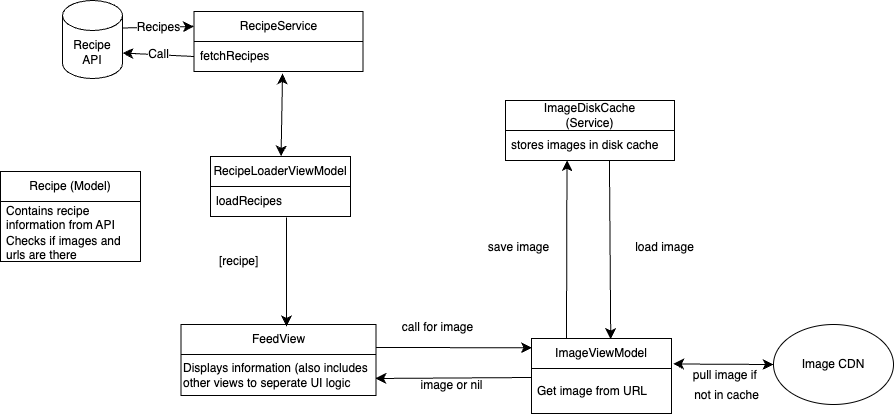

## Summary: Include screen shots or a video of your app highlighting its features

  
  
  

#### Demo 1: Feed View and Recipe Details

The first demo shows the **Feed View**, where users can scroll through a collection of recipe images. Clicking on an image navigates to a detailed **Recipe View**, which displays the recipe name, cuisine type, and—if available—a YouTube video tutorial and a button linking to the full recipe on an external website.

#### Demo 2: Refresh and Pagination

The second demo shows the refresh behavior, which resets the list of recipes by reloading the data from the source. Although the data remains the same, the same recipe images will appear after refreshing. It also demonstrates pseudo-pagination: only 20 recipes are initially displayed, and more are loaded dynamically as the user scrolls down the feed.

#### Architecture Overview

The third image shows the overall architecture of the app. It separates concerns between data fetching (`RecipeService`), state management (`RecipeLoaderViewModel`), UI (`FeedView`), and image caching (`ImageViewModel` + `ImageDiskCache`). I spent time designing the structure to ensure that each component had a clear responsibility, which made the implementation easier to manage, debug, and extend.

## Focus Areas: What specific areas of the project did you prioritize? Why did you choose to focus on these areas?
First, I spent time thinking about the type of app I wanted to build. I decided on a recipe discovery app inspired by Pinterest, focusing on visual content arranged in a scrollable feed. This direction shaped how I approached the UI—prioritizing a grid layout, lightweight pagination, and recipe cards that lead into more detailed views—while keeping performance in mind.

One of my main priorities was establishing a clear and scalable project structure by following the MVVM (Model-View-ViewModel) architectural pattern. I wanted to ensure that data handling, UI logic, and service layers were properly separated to make the codebase easier to maintain and extend. This helped me avoid tightly coupled components and made it simpler to test and debug individual parts of the app.

Another area I dedicated time to was image caching. This was my first time implementing a custom image caching system, so I wanted to fully understand how to store and retrieve images efficiently to reduce unnecessary network usage. I built a local disk caching system through an `ImageDiskCache` service, which interacts with the `ImageViewModel` to first check the cache before pulling from a remote CDN.

## Time Spent: Approximately how long did you spend working on this project? How did you allocate your time?

I spent around 14 hours on this project, with time allocated across several key areas:

#### Planning and Ideation: ~1 hour  
I explored different app ideas before deciding on a recipe discovery concept. I sketched out core features and took UI inspiration from Pinterest to inform the design.

#### Architecture and Structure (MVVM): ~3 hours  
During the initial stages of coding, I created a visual architecture diagram and structured the project to follow the MVVM pattern. This helped ensure a clean separation of concerns and made the codebase easier to extend and maintain.

#### Image Caching: ~3 hours  
Since this was my first time handling image caching, I spent time learning how to implement a custom disk caching system. This ensured efficient image loading and reduced redundant network usage.

#### UI, Interaction, General Coding: ~5 hours  
I developed a scrollable Pinterest-style feed and a detail view for each recipe. This included setting up pseudo-pagination, navigation between views, and conditional UI elements like YouTube videos and external recipe links.

#### Testing and Debugging: ~1 hour  
I wrote basic tests to confirm that recipes loaded correctly and verified that image caching and pagination behaved as expected.

#### Documentation (README and Architecture Diagram): ~1 hour  
I documented the project with a clear README, demo visuals, and an architecture diagram to explain the overall structure and functionality of the app.

## Trade-offs and Decisions: Did you make any significant trade-offs in your approach?
Since the data provided for the challenge was a static JSON file, I focused on building features like pagination and refresh without real-time updates or dynamic data handling.

## Weakest Part of the Project: What do you think is the weakest part of your project?

The weakest part of the project is the UI. I had hoped to make it feel more like a fully developed social media app, with a more polished and interactive design. Some of the layout and spacing choices weren’t ideal, but I chose to focus on functionality and core features instead of spending too much time refining the visuals.

## Additional Information: Is there anything else we should know? Feel free to share any insights or constraints you encountered.

#### There were a few small features I wanted to include but didn’t get to within the time frame:
- No filtering by cuisine type
- No pseudo way to create or submit a new recipe
- No functionality for saving or liking recipes
- No search functionality for finding recipes by name or ingredients
- No advanced UX gesture for dismissing the detail view (currently only a back button; I wanted a more fluid gesture like in Pinterest)
